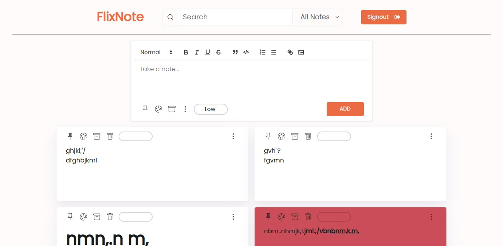
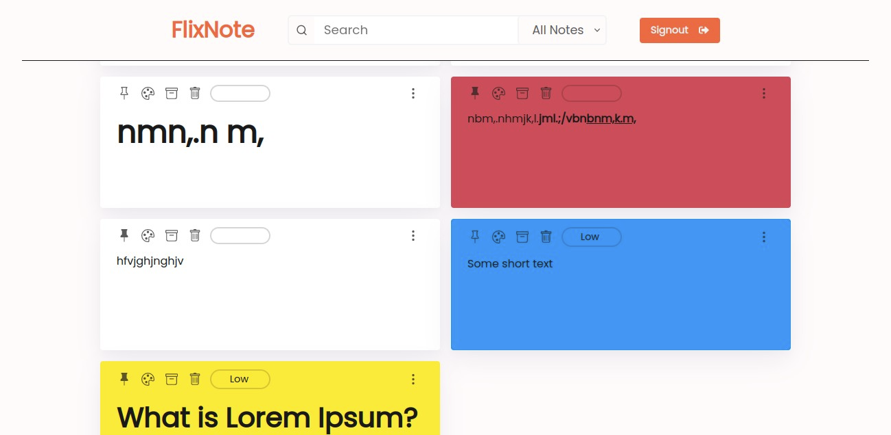

[](https://github.com/Debarshi95/FlixNotes/actions)

# FlixNotes

A ReactJS web app for managing notes.

## Demo

[Deployed on Netlify using github actions](https://debarshib-flixnotes.netlify.app)

## Features:

- Authentication facility for old & new users
- Authenticated users can create, edit, update, delete new and old notes
- Custom debounce function to optimize network request when editing notes
- Each Note has the following facilities:
  - Change background color
  - Add/Delete labels
  - Pin/Unpin notes
  - Set notes to **ACTIVE** / **TRASH** or **ARCHIVE**
- Filter notes by:
  - Tags
  - Priority
  - Status
- Edit note data, remove, add, update, pin note and note tags.
- LazyLoading/Code-splitting of components to dynamically load at runtime
- Error management using ErrorBoundary to catch and show fallback UI.
- LazyLoading/Code-splitting of components.
- Loading Spinner when fetching initial data.
- Responsive UI for all screens (Desktop, Tablet, Mobile)

## Built using:

- [ReactJS](https://reactjs.org/) - Frontend framework
- [React Router](https://reactrouter.com/) - For routing & navigation
- [Firebase](https://firebase.google.com) - serves as backend to store data and authentication
- [React-Hot-Toast](https://react-hot-toast.com) - to show Toast Notifications
- [React-Quill](https://zenoamaro.github.io/react-quill) - a rich text editor

## Screenshots

#### Desktop






<br/>

#### Mobile

<br/>
<div align="center">


</div>

## Run Locally

- Clone the project
  `git clone https://github.com/Debarshi95/FlixNotes.git`
- Go to the project directory
- cd flix-nots
- Install dependencies
  `yarn`
- Create a **.env** file
- Create a project inside Google Firebase and export the configuration
- Add the following configuration to your .env file

```
REACT_APP_API_KEY="<Firebase API_KEY>"
REACT_APP_AUTH_DOMAIN="<Firebase AUTH_DOMAIN>"
REACT_APP_PROJECT_ID="<Firebase PROJECT_ID>"
REACT_APP_STORAGE_BUCKET="<Firebase STORAGE_BUCKET>"
REACT_APP_MESSAGING_SENDER_ID="<Firebase MESSAGING_SENDER_ID>"
REACT_APP_APP_ID="<Firebase APP_ID>"
```

- Start the server
  `yarn start`
